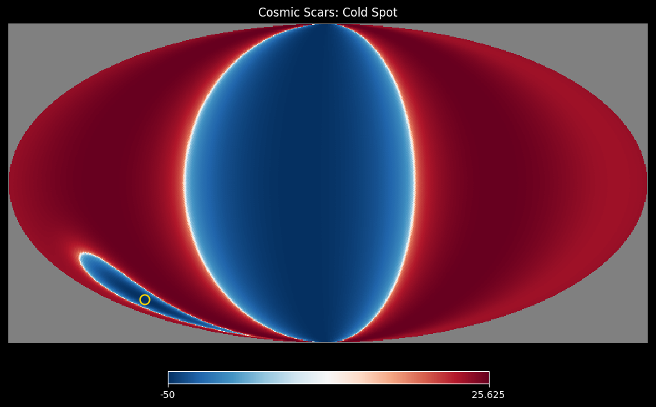
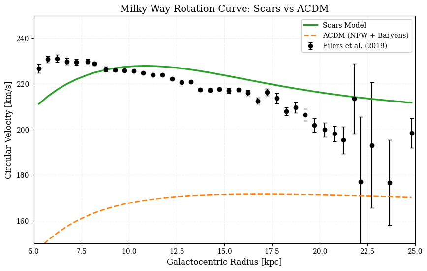

     # 🌌 Cosmic Scars: Topological Gravity Without Dark Matter  

   ## 📜 Paper  
   - [PDF](paper/scars_v19.pdf) | [LaTeX](paper/scars_v19.tex)  

   ## 🖼️ Key Figures  
     
     

   ## 🚀 How to Contribute  
   - **Challenge 1**: Fit Gaia DR3 data to Scars model. Alternatively use Eiler data.
   - **Goal**: Improve `MilkyWay_Rotation.py` using Gaia DR3 data ([link](https://gea.esac.esa.int/archive/)).
   - **Reward**: Collaboration mention in v21 paper!  

          - Currently there is a code that generates a image with graphs that correlates two NGC galaxies using real data with Scars model and the Milky Way using sinthetic data with Scars model
          - Another code use Eilers real Milky Way stars rotation speed and kpc from galaxy centre vs Scars model and LambdaCDM model
          - Gaia DR3 data can be extracted from https://gea.esac.esa.int/archive/  ## SEARCH ## Advanced ADQL
               Use the query provided in GAIA_DR3 folder as an example. That query extracts stars from 5kpc to 5.5kpc from galactic center. A sample of the result can be find here. Each record is a Star. To use proper units as kpc from galactic centre or rotation speed is key. Noise expected from 0 to 5kpc. Chaotic data beyond 25kpc. Ideal graph- 0 to 100 kpc. Realistic: 5 to 30 kpc. Modify `scars_MW()` function to fit better
               Result: improve mw_rotation_final.png

     
   - **Challenge 2**: Improve Weyl curvature projections
   - **Reward**: Collaboration mention in v21 paper!  
          - Projection of Weyl curvature and Scar footprint on CMB map
               Result: Improve weyl and scar cmb maps....base phyton code for 4 maps provided

   - **Challenge 3**: SIMULATE LISA GWs FROM SCARS  
   - **Goal**: Implement Eq. 40 of the paper in `lisa_gws.py`.  
   - **Reward**: Collaboration mention in v21 paper!  


## 🔗 CONTACT ME  

[](https://twitter.com/abertranp)  

Hint:  
```python  
def omega_gw(f):  
    return 1e-8 * (f/1e-5)**(-3)  # Base model (improve me!)


