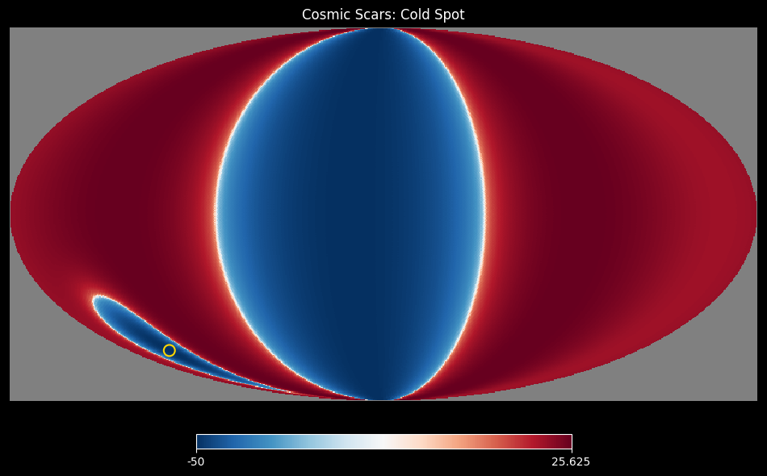
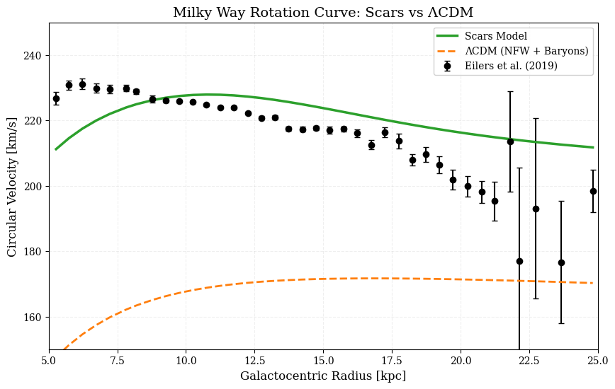

     # 🌌 Cosmic Scars: Topological Gravity Without Dark Matter  

   ## 📜 Paper  
   - [PDF](paper/scars_v19.pdf) | [LaTeX](paper/scars_v19.tex)
   - 2025/06/06 update: v21 ready at https://zenodo.org/records/15482535

   ## 🖼️ Key Figures  
     
     

   ## 🚀 How to Contribute  
     
   - **Challenge 1**: Improve Weyl curvature projections
   - **Reward**: Collaboration mention in v22 paper!  
          - Projection of Weyl curvature and Scar footprint on CMB map
               Result: Improve weyl and scar cmb maps....base phyton code for 4 maps provided

   - **Challenge 2**: SIMULATE LISA GWs FROM SCARS  
   - **Goal**: Implement Eq. 40 of the paper in `lisa_gws.py`.  
   - **Reward**: Collaboration mention in v21 paper!  


## 🔗 CONTACT ME  

[](https://twitter.com/abertranp)  

Hint:  
```python  
def omega_gw(f):  
    return 1e-8 * (f/1e-5)**(-3)  # Base model (improve me!)


